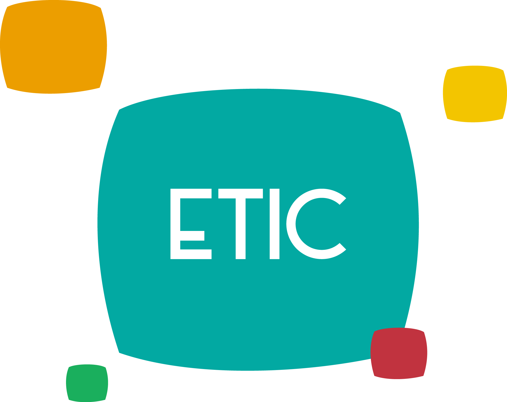
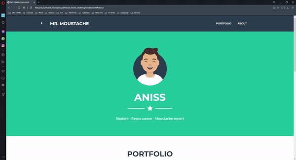

## **Mini-challenge de recrutement ETICien 👻**
### **Hello there !**
Ce repo est déstiné aux ETICiens dans le cadre du rectruement de la cellule dev. Veuillez suivre les étapes suivantes pour soumettre votre solution: 

#### **Ressources et to-do (frontend):**
> Dans "frontend" vous trouverez un template de siteweb one-page "portfolio" que vous devez recréer en utilisant des technologies et frameworks de votre choix.
- Essayez d'utiliser vos propres informations/ressources (images, contenu, ...)
- Rajoutez une section "submission form" sans son code backend (la partie frontend uniquement)
- Ajoutez des animations simples pour les différents élements (au moins 2)

- Don't limit your imagination and creativity, vous n'etes pas obligés de respecter le modèle, ce dernier n'est que pour s'inspirer ^^

> Modèle du site à recréer :

 

#### **Ressources et to-do (backend):**
> Dans "backend" vous trouverez le frontend pour un simple formulaire d'authentification/inscription.

- Utilisez MangoDB, Nodejs, Express et bcrypt
- Rajoutez votre code dans server.js
- Testez votre solution
  
#### **Comment soumettre votre solution:**
> 1°/ Fork the repo 

> 2°/ Create a branch with your name and add your solution

> 3°/ Submit a pull request

#### **Deadline : 05/03/2022**

## **ETICiennement ! ❤️**

